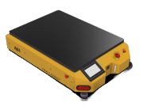

<div align="center">


<br/><br/>

```
                    ████████╗██████╗  █████╗ ██╗██╗      ██████╗ ██████╗  ██████╗ ████████╗
                       ██╔══╝██╔══██╗██╔══██╗██║██║     ██╔═══██╗██╔══██╗██╔═══██╗╚══██╔══╝
                       ██║   ██████╔╝███████║██║██║     ██║   ██║██████╔╝██║   ██║   ██║
                       ██║   ██╔══██╗██╔══██║██║██║     ██║   ██║██╔══██╗██║   ██║   ██║
                       ██║   ██║  ██║██║  ██║██║███████╗╚██████╔╝██████╔╝╚██████╔╝   ██║
                       ╚═╝   ╚═╝  ╚═╝╚═╝  ╚═╝╚═╝╚══════╝ ╚═════╝ ╚═════╝  ╚═════╝   ╚═╝
```
<div align="center">
  
</div>
# 🤖 Trailobot Simulation

### Autonomous Mobile Robot — ROS 2 Humble × Gazebo Fortress

*Developed by **AutobotX-LAB** · A division of **AIFARM ROBOTICS FACTORY** · 2024–2025*

---

[🚀 Quick Start](#-quick-start) &nbsp;·&nbsp;
[📦 Packages](#-package-overview) &nbsp;·&nbsp;
[⚙️ Installation](#️-installation) &nbsp;·&nbsp;
[🗺️ SLAM & Navigation](#️-slam--navigation) &nbsp;·&nbsp;
[🎮 Teleoperation](#-teleoperation) &nbsp;·&nbsp;
[🌐 Web Dashboard](#-web-dashboard) &nbsp;·&nbsp;
[🤝 Contributing](#-contributing)

</div>

---

## 📖 Overview

**Trailobot** is an indoor-focused Autonomous Mobile Robot (AMR) designed, simulated, and validated by **AutobotX-LAB** under **AIFARM ROBOTICS FACTORY**. This repository contains the complete ROS 2 simulation stack for Trailobot, including robot description, dual-LiDAR sensor fusion, navigation, teleoperation, and a live web monitoring dashboard — all running in **Gazebo Fortress**.

Autonomous mobile robots are increasingly vital for automation in logistics, surveillance, and service sectors. Trailobot targets demanding indoor environments:

> 🏭 **Warehouses** · 🏥 **Hospitals** · 🔬 **Research Facilities** · 🏗️ **Factories**

### Core Capabilities

| Capability | Description |
|---|---|
| 🗺️ **SLAM** | Online mapping & localization in unknown environments |
| 🧭 **Autonomous Navigation** | DWB & MPPI planners via Nav2 stack |
| 🚧 **Obstacle Avoidance** | Static and dynamic obstacle detection |
| 📡 **Dual LiDAR Fusion** | Front + rear laser scans merged via `ros2_laser_scan_merger` |
| 🎮 **Teleoperation** | Keyboard and joystick manual control |
| 🌐 **Web Dashboard** | Real-time remote monitoring and control |
| 💬 **Custom Interfaces** | Bespoke ROS 2 messages and services via `trailobot_interfaces` |

---

## 🗂️ Repository Structure

```
Trailobot_Simulation/
│
├── 📁 ros2_laser_scan_merger/       # Dual LiDAR scan merging utility
│   ├── src/
│   │   └── laser_scan_merger.py
│   ├── launch/
│   ├── package.xml
│   └── CMakeLists.txt
│
├── 📁 trailobot_description/        # Robot URDF model, meshes & Gazebo plugins
│   ├── urdf/
│   │   ├── trailobot.urdf.xacro     # Main robot description
│   │   ├── robot_core.xacro         # Chassis, wheels, joints
│   │   └── sensors.xacro            # LiDAR, IMU, ultrasonic
│   ├── meshes/                      # 3D mesh files (.stl / .dae)
│   ├── rviz/
│   │   └── trailobot.rviz
│   ├── package.xml
│   └── CMakeLists.txt
│
├── 📁 trailobot_interfaces/         # Custom ROS 2 messages, services & actions
│   ├── msg/
│   ├── srv/
│   ├── action/
│   ├── package.xml
│   └── CMakeLists.txt
│
├── 📁 trailobot_launch/             # Top-level launch orchestration
│   ├── launch/
│   │   ├── trailobot_sim.launch.py  # Full simulation bringup
│   │   ├── slam.launch.py           # SLAM only
│   │   ├── navigation.launch.py     # Navigation only
│   │   └── display.launch.py        # RViz2 visualization
│   ├── config/
│   │   ├── nav2_params.yaml
│   │   └── slam_toolbox_params.yaml
│   ├── worlds/
│   │   └── trailobot_world.world
│   ├── package.xml
│   └── CMakeLists.txt
│
├── 📁 trailobot_teleop/             # Keyboard & joystick teleoperation
│   ├── trailobot_teleop/
│   │   └── teleop_key.py
│   ├── launch/
│   │   └── teleop.launch.py
│   ├── package.xml
│   └── setup.py
│
├── 📁 trailobot_web/                # Web monitoring & control dashboard
│   ├── trailobot_web/
│   │   ├── web_server.py            # rosbridge / Flask backend
│   │   └── static/                  # Frontend (HTML, JS, CSS)
│   ├── launch/
│   │   └── web.launch.py
│   ├── package.xml
│   └── setup.py
│
└── 📄 .gitignore
```

---

## 📐 System Architecture

```
┌──────────────────────────────────────────────────────────────────────────┐
│                           TRAILOBOT SYSTEM                               │
│                                                                          │
│  ┌─────────────────┐     ┌──────────────────────────────────────────┐   │
│  │    SENSORS       │     │           SENSOR FUSION                  │   │
│  │                  │────▶│                                          │   │
│  │  Front LiDAR     │     │  ros2_laser_scan_merger                  │   │
│  │  Rear  LiDAR     │────▶│  → Unified /scan topic (360°)           │   │
│  │  IMU             │     │  robot_localization (EKF)                │   │
│  │  Wheel Encoders  │     │  → Fused /odom topic                    │   │
│  │  Ultrasonic      │     └──────────────┬───────────────────────────┘   │
│  └─────────────────┘                    │                               │
│                                         ▼                               │
│  ┌──────────────────────────────────────────────────────────────────┐   │
│  │                    SLAM TOOLBOX                                   │   │
│  │   /scan + /odom  →  /map + /tf (map → odom → base_link)          │   │
│  └──────────────────────────────┬───────────────────────────────────┘   │
│                                 │                                        │
│                                 ▼                                        │
│  ┌──────────────────────────────────────────────────────────────────┐   │
│  │                    NAV2 NAVIGATION STACK                          │   │
│  │   Global Planner  (NavFn / SmacPlanner)                           │   │
│  │   Local Planner   (DWB  or  MPPI Controller)                     │   │
│  │   Costmaps        (Static + Inflation + Obstacle layers)         │   │
│  └──────────────────────────────┬───────────────────────────────────┘   │
│                                 │ /cmd_vel                               │
│              ┌──────────────────┤                                        │
│              │                  ▼                                        │
│  ┌──────────────────┐  ┌───────────────────────────────────────────┐   │
│  │  trailobot_teleop│  │  Gazebo Fortress — Differential Drive      │   │
│  │  (keyboard/joy)  │  │  → Left & Right Wheel Velocities           │   │
│  └──────────────────┘  └───────────────────────────────────────────┘   │
│                                                                          │
│  ┌──────────────────────────────────────────────────────────────────┐   │
│  │           trailobot_web — Live Web Dashboard (port 8080)          │   │
│  │   Map · Pose · Sensor Feed · Goal Setting · Manual Override       │   │
│  └──────────────────────────────────────────────────────────────────┘   │
└──────────────────────────────────────────────────────────────────────────┘
```

---

## ⚙️ Installation

### Prerequisites

| Tool | Version | Notes |
|---|---|---|
| Ubuntu | 22.04 LTS | Required for ROS 2 Humble |
| ROS 2 | Humble Hawksbill | Full desktop install |
| Gazebo | Fortress (Ignition) | With `ros-humble-ros-gz` bridge |
| Python | 3.10+ | Primary implementation language |
| colcon | latest | ROS 2 build tool |

### Step 1 — Install ROS 2 Humble

```bash
# Set locale
sudo apt update && sudo apt install locales -y
sudo locale-gen en_US en_US.UTF-8
sudo update-locale LC_ALL=en_US.UTF-8 LANG=en_US.UTF-8

# Add ROS 2 apt repository
sudo apt install software-properties-common curl -y
sudo curl -sSL https://raw.githubusercontent.com/ros/rosdistro/master/ros.key \
  -o /usr/share/keyrings/ros-archive-keyring.gpg
echo "deb [arch=$(dpkg --print-architecture) signed-by=/usr/share/keyrings/ros-archive-keyring.gpg] \
  http://packages.ros.org/ros2/ubuntu $(. /etc/os-release && echo $UBUNTU_CODENAME) main" \
  | sudo tee /etc/apt/sources.list.d/ros2.list > /dev/null

# Install ROS 2 Desktop
sudo apt update && sudo apt install ros-humble-desktop -y
echo "source /opt/ros/humble/setup.bash" >> ~/.bashrc
source ~/.bashrc
```

### Step 2 — Install Gazebo Fortress & ROS–Gazebo Bridge

```bash
sudo apt install ignition-fortress -y
sudo apt install ros-humble-ros-gz -y
sudo apt install ros-humble-gz-ros2-control -y
```

### Step 3 — Install Nav2, SLAM & Localization

```bash
sudo apt install ros-humble-navigation2 ros-humble-nav2-bringup -y
sudo apt install ros-humble-slam-toolbox -y
sudo apt install ros-humble-robot-localization -y
sudo apt install ros-humble-twist-mux -y
```

### Step 4 — Clone & Build Trailobot

```bash
# Create workspace
mkdir -p ~/trailobot_ws/src
cd ~/trailobot_ws/src

# Clone the repository
git clone https://github.com/boyloy21/Trailobot_Simulation.git

# Install all ROS and Python dependencies
cd ~/trailobot_ws
rosdep install --from-paths src --ignore-src -r -y

# Build
colcon build --symlink-install
source install/setup.bash
```

> 💡 **Tip:** Add `source ~/trailobot_ws/install/setup.bash` to your `~/.bashrc` to avoid re-sourcing every session.

---

## 🚀 Quick Start

### Full Simulation (Gazebo + SLAM + Navigation + RViz2)

```bash
ros2 launch trailobot_launch trailobot_sim.launch.py
```

### Launch Individual Components

```bash
# Gazebo simulation only
ros2 launch trailobot_launch trailobot_sim.launch.py slam:=false navigation:=false rviz:=false

# SLAM mapping
ros2 launch trailobot_launch slam.launch.py

# Navigation with a pre-built map
ros2 launch trailobot_launch navigation.launch.py map:=/path/to/map.yaml

# RViz2 visualization only
ros2 launch trailobot_launch display.launch.py
```

### Send a Navigation Goal via CLI

```bash
ros2 action send_goal /navigate_to_pose nav2_msgs/action/NavigateToPose \
  "{pose: {header: {frame_id: 'map'}, pose: {position: {x: 2.5, y: 1.0, z: 0.0}, \
  orientation: {w: 1.0}}}}"
```

---

## 📦 Package Overview

### `trailobot_description`
The complete robot model in **URDF/XACRO** format, including:
- Differential drive chassis with two driven wheels and two caster wheels
- Two 2D LiDAR sensors (front-mounted and rear-mounted)
- IMU and wheel encoder plugins for Gazebo Fortress
- Ultrasonic sensors for close-range proximity detection

```bash
# Visualize the robot model in RViz2
ros2 launch trailobot_launch display.launch.py
```

---

### `ros2_laser_scan_merger`
Merges the front (`/scan_front`) and rear (`/scan_rear`) `sensor_msgs/LaserScan` topics into a **single unified `/scan` topic**, giving Trailobot full **360° coverage** for SLAM and obstacle avoidance.

```bash
# Run standalone
ros2 run ros2_laser_scan_merger laser_scan_merger
```

| Parameter | Default | Description |
|---|---|---|
| `scan_topic_1` | `/scan_front` | First LiDAR input topic |
| `scan_topic_2` | `/scan_rear` | Second LiDAR input topic |
| `output_topic` | `/scan` | Merged output topic |
| `frame_id` | `base_link` | Reference frame for merged scan |

---

### `trailobot_interfaces`
Custom ROS 2 interface definitions shared across all packages:

```bash
# Inspect all Trailobot custom interfaces
ros2 interface list | grep trailobot
```

---

### `trailobot_launch`
Centralised launch orchestration for the entire stack. All simulation configs and Nav2/SLAM parameters live here.

```
trailobot_launch/
├── launch/
│   ├── trailobot_sim.launch.py   ← Full bringup
│   ├── slam.launch.py
│   ├── navigation.launch.py
│   └── display.launch.py
├── config/
│   ├── nav2_params.yaml
│   └── slam_toolbox_params.yaml
└── worlds/
    └── trailobot_world.world
```

---

### `trailobot_teleop`
Python teleoperation node for keyboard manual control.

```bash
ros2 run trailobot_teleop teleop_key
# or
ros2 launch trailobot_teleop teleop.launch.py
```

**Keyboard Controls:**
```
        w
   a    s    d       w / x : increase / decrease linear speed
        x            a / d : increase / decrease angular speed
                     s     : full stop
                  CTRL+C   : quit
```

---

### `trailobot_web`
Live web dashboard for remote monitoring and control.

```bash
ros2 launch trailobot_web web.launch.py
# Open: http://localhost:8080
```

**Dashboard Features:**
- 📍 Live robot pose on 2D occupancy map
- 📊 Real-time LiDAR scan display
- 🧭 IMU orientation indicator
- 🎮 On-screen joystick for manual override
- 🗺️ Click-to-navigate goal selection on the map
- 📋 Navigation log and status feed

---

## 🗺️ SLAM & Navigation

### Step 1 — Build a Map (Online SLAM)

```bash
# Terminal 1: Launch simulation + SLAM
ros2 launch trailobot_launch trailobot_sim.launch.py slam:=true navigation:=false

# Terminal 2: Drive the robot to explore the environment
ros2 launch trailobot_teleop teleop.launch.py

# Terminal 3: Save the completed map
ros2 run nav2_map_server map_saver_cli -f ~/maps/trailobot_map
```

### Step 2 — Navigate with the Saved Map

```bash
ros2 launch trailobot_launch trailobot_sim.launch.py \
  slam:=false \
  navigation:=true \
  map:=$HOME/maps/trailobot_map.yaml
```

### Planner Configuration

Switch between **DWB** and **MPPI** in `trailobot_launch/config/nav2_params.yaml`:

```yaml
# DWB — Dynamic Window Approach (default, stable)
FollowPath:
  plugin: "dwb_core::DWBLocalPlanner"
  max_vel_x: 0.5
  max_vel_theta: 1.0

# MPPI — Model Predictive Path Integral (smooth, dynamic)
FollowPath:
  plugin: "nav2_mppi_controller::MPPIController"
  time_steps: 56
  model_dt: 0.05
  batch_size: 2000
```

---

## 🤖 Robot Specifications

| Parameter | Value |
|---|---|
| **Drive Type** | Differential Drive (2WD + 2 casters) |
| **Primary Language** | Python 3.10 (95.7%) |
| **LiDAR Config** | Dual 2D LiDAR → merged 360° scan |
| **IMU** | 6-DOF (3-axis accel + 3-axis gyro) |
| **Proximity Sensing** | Ultrasonic sensors (front/rear) |
| **Simulation Engine** | Gazebo Fortress (Ignition) |
| **Navigation Stack** | Nav2 (ROS 2 Humble) |
| **SLAM** | SLAM Toolbox (online & localization modes) |
| **State Estimation** | robot_localization EKF |

---

## 🐛 Troubleshooting

**Gazebo crashes on startup?**
```bash
ign gazebo --versions           # confirm Fortress is installed
source /opt/ros/humble/setup.bash
source ~/trailobot_ws/install/setup.bash
```

**Robot not responding to commands?**
```bash
ros2 topic echo /cmd_vel        # confirm velocity commands are published
ros2 topic list | grep odom     # confirm odometry is active
```

**Scan merger output empty?**
```bash
ros2 topic hz /scan_front       # verify front LiDAR is publishing
ros2 topic hz /scan_rear        # verify rear LiDAR is publishing
ros2 topic echo /scan --once    # check merged scan output
```

**SLAM map not building?**
```bash
ros2 run tf2_tools view_frames  # inspect TF tree completeness
ros2 topic echo /scan --once    # confirm merged scan is available
```

**Web dashboard not loading?**
```bash
ros2 node list | grep rosbridge # check rosbridge is active
lsof -i :8080                   # check port availability
```

---

## 🤝 Contributing

Contributions are welcome! Please follow these steps:

1. **Fork** the repository
2. **Create** a feature branch: `git checkout -b feature/your-feature`
3. **Commit** your changes: `git commit -m 'feat: describe your change'`
4. **Push**: `git push origin feature/your-feature`
5. **Open a Pull Request** against `main`

Please follow [ROS 2 Python style guidelines](https://docs.ros.org/en/humble/The-ROS2-Project/Contributing/Code-Style-Language-Versions.html) and run `colcon test` before submitting.

---

## 📄 License

This project is licensed under the **MIT License** — see the [LICENSE](LICENSE) file for details.

---

## 📬 Contact & Credits

| | |
|---|---|
| **Repository** | [github.com/boyloy21/Trailobot_Simulation](https://github.com/boyloy21/Trailobot_Simulation) |
| **Author** | [@boyloy21](https://github.com/boyloy21) |
| **Organization** | AutobotX-LAB · AIFARM ROBOTICS FACTORY |
| **Project Period** | 2024 – 2025 |

---

<div align="center">

Made with ❤️ by **AutobotX-LAB**

*AIFARM ROBOTICS FACTORY · 2024–2025*

</div>
